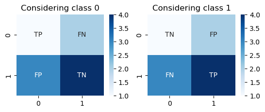

### K-NN (k- Nearest Neighbours) algorithm

K's nearest neighbors are algorithm is a classification algorithm that takes a bunch of labeled points and uses them to learn how to label other points.

#### K-NN process steps

1. Pick a value of K
2. Calculate the distance of the unknown case form all cases
3. Select the k-observation in the training data that is "nearest" to the unknown data point
4. Predict the response of the unknown data point using the most popular response value from the k-nearest neighbors

#### How to calculate the distance ?

Assume there are two customers. Cus1 and Cus2 have only one feature (age). To calculate the distance, we can use the Minkowski distance.

$$ Minkowski Distnace=  \sqrt{ \sum_{i=0}^{n}\left( x_{1_{i}}-x_{2_{i}} \right)^2} $$

If the Cus1's age is 34; and Cus2's age is 30 then the Distance is 

> Note: Not only Minkowski you can use any other distance model 

$$Dis(x_{1}, x_{2}) = \sqrt{(34-30)^2} = 4$$

If there are two features (age (34, 30) and income (200, 190)), the value after applying the Minkowski equation will be

$$Dis(x_{1}, x_{2}) = \sqrt{(34-30)^2 + (190-200)^2} = 11.87$$

#### How to pick the best K value

You can select k randomly, compute the accuracy, and increase or decrease the value of k until you get high accuracy.

#### How to compute the Accuracy 

To determine the model's accuracy, we compare the actual value in the test set to the predicted value. There are different models that can be used to determine the accuracy of the classification algorithms. such as Jaccard index, F1-score, Log Loss

1. Jaccard Index

$$J(y', y_{}) = \frac{|y\cap y'|}{|y\cup y'|}$$

where y is the actual labels, and y is predicted labels

2. F1-score (confusion matrix)


- Precision
$$Precision=\frac{TP}{TP+FP}$$
- Recall 
$$Recall=\frac{TP}{TP+FN}$$
- F1-score
$$F1-score = \frac{2(Precision*Recall)}{Precision+Precision}$$


```python
cm = np.array([[1,   2],[3,  4]])
considering_class_0=np.array([['TP','FN'],['FP','TN']])
considering_class_1=np.array([['TN','FP'],['FN','TP']])
import seaborn as sns
import matplotlib.pyplot as plt     

plt.figure(1)
plt.subplot(221)
sns.heatmap(cm, annot=considering_class_0,fmt="", cmap='Blues')
plt.title('Considering class 0')
plt.subplot(222)
sns.heatmap(cm, annot=considering_class_1,fmt="", cmap='Blues')
plt.title('Considering class 1')
```


    Text(0.5, 1.0, 'Considering class 1')


    

    


>Note: The confusion matrix is changed depending on the selected class. if there are two classes the recall, precision, and f1-score of each class should compute, then the average of F1-score will consider as the F1-score.

3- Log Loss
$$Log Loss = -\frac{1}{n}\sum_{}^{} y\times log(y')+(1-y)\times log(1-y')$$

>Note: Low log loss mean high accuracy

